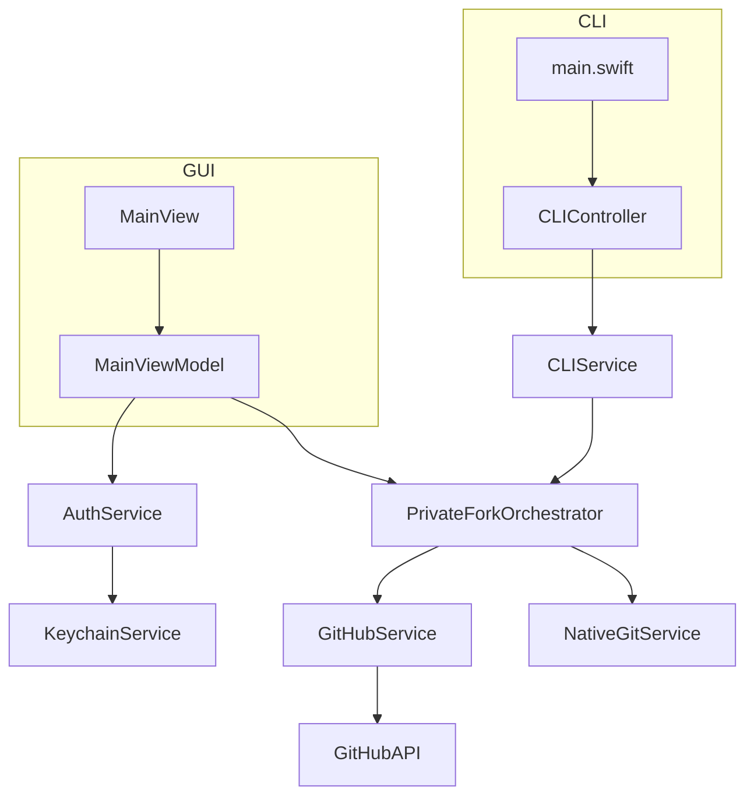

# PrivateFork Phase 2 Brownfield Enhancement Architecture

## Introduction

[cite_start]This document outlines the architectural approach for enhancing the PrivateFork macOS application with Phase 2 features, including OAuth 2.0 authentication, a modernized CLI, and the replacement of the shell-based Git service with a native Swift library[cite: 148]. [cite_start]Its primary goal is to serve as the guiding architectural blueprint for AI-driven development of new features while ensuring seamless integration with the existing system[cite: 149].

[cite_start]**Relationship to Existing Architecture:** This document supplements the existing PrivateFork Brownfield Architecture Document by defining how new components will integrate with the current system[cite: 151]. [cite_start]Where conflicts arise between new and existing patterns, this document provides guidance on maintaining consistency while implementing enhancements[cite: 152].

### Existing Project Analysis

#### Current Project State

-   [cite_start]**Primary Purpose:** PrivateFork is a native macOS application built with Swift and SwiftUI[cite: 155]. [cite_start]It currently functions as a simple utility with a GUI and CLI to fork a public GitHub repository to a user's account and clone it locally[cite: 156].
-   [cite_start]**Current Tech Stack:** Swift, SwiftUI, and shell commands for Git operations[cite: 157].
-   [cite_start]**Architecture Style:** The application's architecture is service-oriented, with a `PrivateForkOrchestrator` acting as a central coordinator for various services[cite: 158].
-   [cite_start]**Deployment Method:** The application is built and archived using standard Xcode processes, and deployment is likely manual[cite: 159].

#### Available Documentation

-   [cite_start]PrivateFork Brownfield Architecture Document [cite: 161]
-   [cite_start]PrivateFork Brownfield Enhancement PRD [cite: 162]

#### Identified Constraints

-   [cite_start]The application must continue to support both GUI and CLI modes[cite: 164].
-   [cite_start]The existing service-oriented architecture should be maintained and extended[cite: 165].
-   [cite_start]The new OAuth flow must be secure and user-friendly[cite: 166].
-   [cite_start]The replacement of the shell-based Git service should not introduce breaking changes to the existing user-facing functionality[cite: 167].

### Change Log

| Change | Date | Version | Description | Author |
| :--- | :--- | :--- | :--- | :--- |
| Library Update | 2025-07-25 | 1.1 | Updated technology choices for OAuth and Git libraries based on new research. | Winston (Architect) |
| Initial Draft | 2025-07-25 | 1.0 | Initial draft of the Phase 2 Brownfield Enhancement Architecture. | Winston (Architect) |

## Enhancement Scope and Integration Strategy

### Enhancement Overview

-   [cite_start]**Enhancement Type:** New Feature Addition (OAuth), Major Feature Modification (Replacing shell-based Git with a native library, enhancing CLI) [cite: 172]
-   [cite_start]**Scope:** This enhancement will replace the PAT-based authentication with a more secure and user-friendly OAuth 2.0 flow, introduce a robust Command-Line Interface (CLI), and integrate a native Swift library for Git operations[cite: 173].
-   [cite_start]**Integration Impact:** Significant Impact (substantial existing code changes) [cite: 174]

### Integration Approach

-   [cite_start]**Code Integration Strategy:** New services will be introduced for authentication and native Git operations[cite: 176]. [cite_start]Existing services will be modified to use these new services[cite: 177].
-   [cite_start]**Database Integration:** The `KeychainService` will be updated to store OAuth tokens instead of PATs[cite: 178].
-   [cite_start]**API Integration:** The `GitHubService` will be modified to use OAuth tokens for authentication[cite: 179].
-   [cite_start]**UI Integration:** The `MainView` and `SettingsView` will be updated to reflect the new authentication state and provide a user-friendly way to sign in and out[cite: 180].

### Compatibility Requirements

-   [cite_start]**Existing API Compatibility:** The existing GitHub API integration will be maintained, with the authentication method updated to use OAuth tokens[cite: 182].
-   [cite_start]**Database Schema Compatibility:** The `KeychainService` will be updated to store OAuth tokens, and a migration path for existing PATs will be considered[cite: 183].
-   [cite_start]**UI/UX Consistency:** The new UI elements for authentication will be consistent with the existing design language of the application[cite: 184].
-   [cite_start]**Performance Impact:** The new native Git library is expected to improve performance by avoiding the overhead of shell commands[cite: 185].

## Tech Stack Alignment

### Existing Technology Stack

| Category | Current Technology | Version | Usage in Enhancement | Notes |
| :--- | :--- | :--- | :--- | :--- |
| Language | Swift | 5.x | Continue to use for all new development. | |
| UI | SwiftUI | | The existing UI will be updated to support the new authentication flow. | |
| Git Operations | Shell commands | | Will be replaced with a native Swift library. | This is a major source of technical debt that will be addressed in this phase. |

### New Technology Additions

| Technology | Version | Purpose | Rationale | Integration Method |
| :--- | :--- | :--- | :--- | :--- |
| SwiftGitX | Latest | Native Git operations | "A pure Swift, modern library that avoids the dependency and Apple Silicon compatibility issues associated with older C-based wrappers like SwiftGit2." | A new `GitService` implementation will be created to wrap the SwiftGitX library. |
| OAuthSwift | Latest | OAuth 2.0 authentication | "A robust, well-maintained library that simplifies OAuth flows, reducing implementation complexity and improving security over native solutions." | A new `AuthService` will be created to handle the OAuth flow using this library. |
| ArgumentParser | Latest | Modern CLI | To provide a more robust and user-friendly CLI experience. | The existing `main.swift` will be updated to use `ArgumentParser`. |

## Data Models and Schema Changes

### New Data Models

#### AuthToken

-   [cite_start]**Purpose:** To store the OAuth access and refresh tokens[cite: 194].
-   [cite_start]**Integration:** This model will be used by the `AuthService` and `KeychainService`[cite: 195].
-   **Key Attributes:**
    -   [cite_start]`accessToken`: String - The OAuth access token[cite: 197].
    -   [cite_start]`refreshToken`: String - The OAuth refresh token[cite: 198].
    -   [cite_start]`expiresIn`: Date - The expiration date of the access token[cite: 199].
-   **Relationships:**
    -   [cite_start]**With Existing:** This model will replace the existing PAT stored in the `KeychainService`[cite: 201].
    -   [cite_start]**With New:** This model will be used by the new `AuthService`[cite: 202].

### Schema Integration Strategy

-   **Database Changes Required:**
    -   [cite_start]**New Tables:** None [cite: 205]
    -   [cite_start]**Modified Tables:** The `KeychainService` will be updated to store the `AuthToken` model instead of a PAT[cite: 206].
    -   [cite_start]**New Indexes:** None [cite: 207]
    -   [cite_start]**Migration Strategy:** A migration path for existing PATs will be provided[cite: 208]. [cite_start]Users will be prompted to re-authenticate using the new OAuth flow, and their existing PAT will be removed from the Keychain[cite: 209].
-   **Backward Compatibility:**
    -   The application will no longer support PAT-based authentication. [cite_start]Users will be required to use the new OAuth flow[cite: 211].

## Component Architecture

### New Components

#### AuthService

-   [cite_start]**Responsibility:** To handle the OAuth 2.0 authentication flow[cite: 215].
-   [cite_start]**Integration Points:** This service will be used by the `MainViewModel` to initiate the authentication process[cite: 216].
-   **Key Interfaces:**
    -   [cite_start]`authenticate()`: Initiates the OAuth device flow[cite: 218].
    -   [cite_start]`refreshToken()`: Refreshes the OAuth access token[cite: 219].
    -   [cite_start]`logout()`: Clears the OAuth tokens from the `KeychainService`[cite: 220].
-   **Dependencies:**
    -   [cite_start]**Existing Components:** `KeychainService` [cite: 222]
    -   [cite_start]**New Components:** None [cite: 223]
-   [cite_start]**Technology Stack:** Swift, OAuthSwift [cite: 224]

#### NativeGitService

-   [cite_start]**Responsibility:** To provide a native Swift implementation of Git operations[cite: 226].
-   [cite_start]**Integration Points:** This service will be used by the `PrivateForkOrchestrator` to perform Git operations[cite: 227].
-   **Key Interfaces:**
    -   [cite_start]`clone(repository: URL, to: URL)`: Clones a repository[cite: 229].
    -   [cite_start]`setRemote(url: URL, for: String)`: Sets the remote URL for a repository[cite: 230].
-   **Dependencies:**
    -   [cite_start]**Existing Components:** None [cite: 232]
    -   [cite_start]**New Components:** None [cite: 233]
-   [cite_start]**Technology Stack:** Swift, SwiftGitX [cite: 234]

#### Modernized CLI

-   [cite_start]**Responsibility:** To provide a robust and user-friendly CLI experience[cite: 236].
-   [cite_start]**Integration Points:** This component will replace the existing `main.swift` entry point for the CLI[cite: 237].
-   **Key Interfaces:**
    -   [cite_start]`privatefork fork <url> --directory <path>`: Forks a repository and clones it to the specified directory[cite: 239].
-   **Dependencies:**
    -   [cite_start]**Existing Components:** `CLIService` [cite: 241]
    -   [cite_start]**New Components:** None [cite: 242]
-   [cite_start]**Technology Stack:** Swift, ArgumentParser [cite: 243]

### Component Interaction Diagram

## API Design and Integration

### API Integration Strategy

-   [cite_start]**API Integration Strategy:** The existing `GitHubService` will be modified to use the OAuth access token for authentication. [cite: 249]
-   [cite_start]**Authentication:** The `AuthService` will handle the OAuth 2.0 flow and provide the access token to the `GitHubService`. [cite: 250]
-   [cite_start]**Versioning:** Not applicable. [cite: 251]

### New API Endpoints

[cite_start]This enhancement does not introduce new API endpoints but modifies how existing endpoints are authenticated. [cite: 253]

## Source Tree Integration

### Existing Project Structure

PrivateFork/
├── Application/
├── Assets.xcassets/
├── Controllers/
├── Models/
├── Services/
│   ├── Implementations/
│   └── Protocols/
├── Utilities/
├── ViewModels/
└── Views/

### New File Organization

PrivateFork/
├── Application/
├── Assets.xcassets/
├── Controllers/
├── Models/
├── Services/
│   ├── Implementations/
│   │   ├── AuthService.swift
│   │   └── NativeGitService.swift
│   └── Protocols/
│       ├── AuthServiceProtocol.swift
│       └── NativeGitServiceProtocol.swift
├── Utilities/
├── ViewModels/
└── Views/

### Integration Guidelines

-   [cite_start]**File Naming:** New files will follow the existing naming conventions. [cite: 260]
-   [cite_start]**Folder Organization:** New services will be placed in the `Services/Implementations` and `Services/Protocols` directories. [cite: 261]
-   [cite_start]**Import/Export Patterns:** New services will be integrated using the existing dependency injection pattern. [cite: 262]

## Infrastructure and Deployment Integration

### Existing Infrastructure

-   [cite_start]**Current Deployment:** The application is built and archived using standard Xcode processes. [cite: 265]
-   [cite_start]**Infrastructure Tools:** None [cite: 266]
-   [cite_start]**Environments:** Debug, Release [cite: 267]

### Enhancement Deployment Strategy

-   [cite_start]**Deployment Approach:** The existing deployment process will be used. [cite: 269]
-   [cite_start]**Infrastructure Changes:** None [cite: 270]
-   [cite_start]**Pipeline Integration:** None [cite: 271]

### Rollback Strategy

-   [cite_start]**Rollback Method:** The application can be rolled back to a previous version by checking out a previous commit and rebuilding. [cite: 273]
-   [cite_start]**Risk Mitigation:** The new features will be thoroughly tested before release. [cite: 274]
-   [cite_start]**Monitoring:** Not applicable. [cite: 275]

## Coding Standards and Conventions

### Existing Standards Compliance

-   [cite_start]**Code Style:** New code will follow the existing code style. [cite: 278]
-   [cite_start]**Linting Rules:** New code will adhere to the existing linting rules. [cite: 279]
-   [cite_start]**Testing Patterns:** New tests will follow the existing testing patterns. [cite: 280]
-   [cite_start]**Documentation Style:** New documentation will follow the existing documentation style. [cite: 281]

### Enhancement-Specific Standards

-   [cite_start]**SwiftGitX:** The `SwiftGitX` library will be used for all native Git operations. [cite: 283]
-   [cite_start]**OAuthSwift:** The `OAuthSwift` library will be used for the OAuth 2.0 flow. [cite: 284]
-   [cite_start]**ArgumentParser:** The `ArgumentParser` library will be used for the modernized CLI. [cite: 285]

### Critical Integration Rules

-   [cite_start]**Existing API Compatibility:** The `GitHubService` will be updated to use OAuth tokens without breaking the existing API. [cite: 287]
-   [cite_start]**Database Integration:** The `KeychainService` will be updated to store OAuth tokens, and a migration path for existing PATs will be provided. [cite: 288]
-   [cite_start]**Error Handling:** The new services will follow the existing error handling patterns. [cite: 289]
-   [cite_start]**Logging Consistency:** The new services will follow the existing logging patterns. [cite: 290]

## Testing Strategy

### Integration with Existing Tests

-   [cite_start]**Existing Test Framework:** The existing `XCTest` framework will be used. [cite: 293]
-   [cite_start]**Test Organization:** New tests will be organized in the same way as existing tests. [cite: 294]
-   [cite_start]**Coverage Requirements:** The existing test coverage will be maintained or improved. [cite: 295]

### New Testing Requirements

#### Unit Tests for New Components

-   [cite_start]**Framework:** `XCTest` [cite: 298]
-   [cite_start]**Location:** `PrivateForkTests/` [cite: 299]
-   [cite_start]**Coverage Target:** 80% [cite: 300]
-   [cite_start]**Integration with Existing:** New tests will be integrated into the existing test plan. [cite: 301]

#### Integration Tests

-   [cite_start]**Scope:** The integration between the new `AuthService`, `NativeGitService`, and the existing `PrivateForkOrchestrator` will be tested. [cite: 303]
-   [cite_start]**Existing System Verification:** The existing integration tests will be updated to use the new authentication and Git services. [cite: 304]
-   [cite_start]**New Feature Testing:** New integration tests will be created to test the OAuth flow and native Git operations. [cite: 305]

#### Regression Testing

-   [cite_start]**Existing Feature Verification:** The existing regression tests will be run to ensure that the new features do not break existing functionality. [cite: 307]
-   [cite_start]**Automated Regression Suite:** The existing automated regression suite will be updated to include tests for the new features. [cite: 308]
-   [cite_start]**Manual Testing Requirements:** The new authentication flow will be manually tested. [cite: 309]

## Security Integration

### Existing Security Measures

-   [cite_start]**Authentication:** PAT-based authentication. [cite: 312]
-   [cite_start]**Authorization:** Not applicable. [cite: 313]
-   [cite_start]**Data Protection:** The `KeychainService` is used to securely store the PAT. [cite: 314]
-   [cite_start]**Security Tools:** None [cite: 315]

### Enhancement Security Requirements

-   [cite_start]**New Security Measures:** OAuth 2.0 authentication will be implemented. [cite: 317]
-   [cite_start]**Integration Points:** The `AuthService` will be integrated with the `MainViewModel` to handle the authentication flow. [cite: 318]
-   [cite_start]**Compliance Requirements:** Not applicable. [cite: 319]

### Security Testing

-   [cite_start]**Existing Security Tests:** None [cite: 321]
-   [cite_start]**New Security Test Requirements:** The new OAuth flow will be tested for security vulnerabilities. [cite: 322]
-   [cite_start]**Penetration Testing:** Not applicable. [cite: 323]

