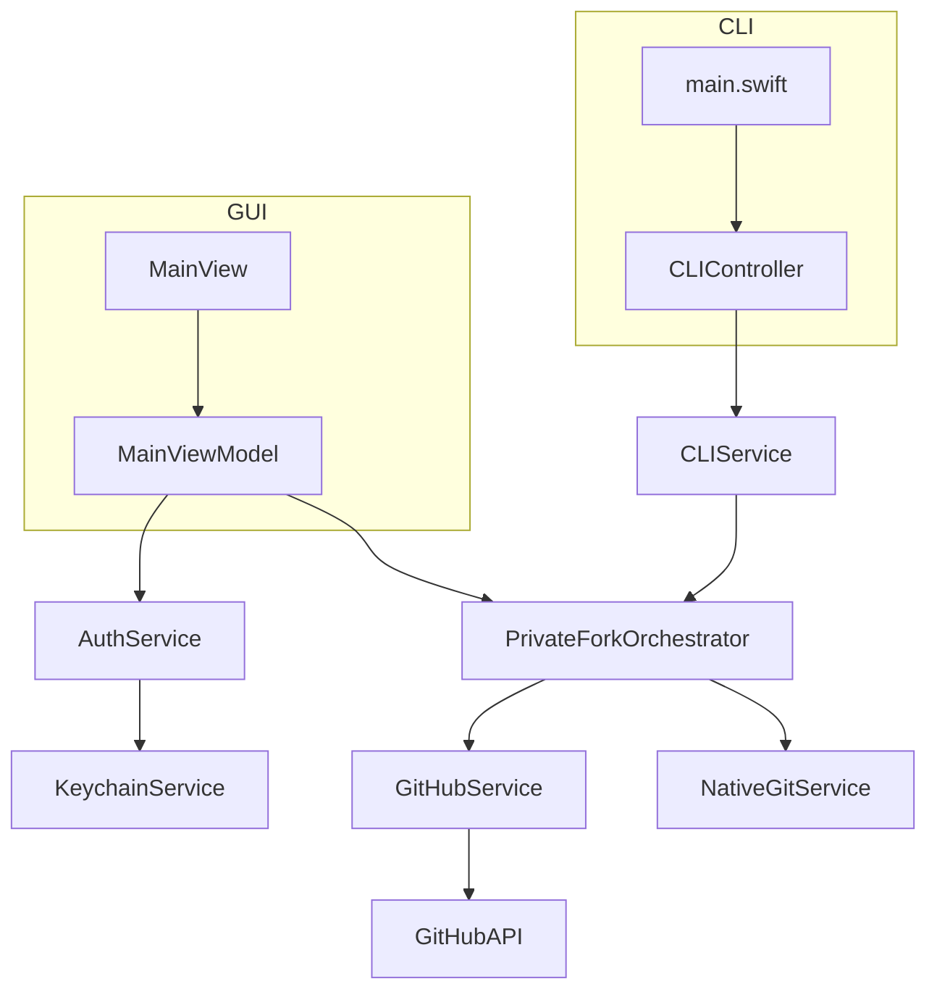

# Component Architecture

## New Components

### AuthService

-   [cite_start]**Responsibility:** To handle the OAuth 2.0 authentication flow[cite: 215].
-   [cite_start]**Integration Points:** This service will be used by the `MainViewModel` to initiate the authentication process[cite: 216].
-   **Key Interfaces:**
    -   [cite_start]`authenticate()`: Initiates the OAuth device flow[cite: 218].
    -   [cite_start]`refreshToken()`: Refreshes the OAuth access token[cite: 219].
    -   [cite_start]`logout()`: Clears the OAuth tokens from the `KeychainService`[cite: 220].
-   **Dependencies:**
    -   [cite_start]**Existing Components:** `KeychainService` [cite: 222]
    -   [cite_start]**New Components:** None [cite: 223]
-   [cite_start]**Technology Stack:** Swift, OAuthSwift [cite: 224]

### NativeGitService

-   [cite_start]**Responsibility:** To provide a native Swift implementation of Git operations[cite: 226].
-   [cite_start]**Integration Points:** This service will be used by the `PrivateForkOrchestrator` to perform Git operations[cite: 227].
-   **Key Interfaces:**
    -   [cite_start]`clone(repository: URL, to: URL)`: Clones a repository[cite: 229].
    -   [cite_start]`setRemote(url: URL, for: String)`: Sets the remote URL for a repository[cite: 230].
-   **Dependencies:**
    -   [cite_start]**Existing Components:** None [cite: 232]
    -   [cite_start]**New Components:** None [cite: 233]
-   [cite_start]**Technology Stack:** Swift, SwiftGitX [cite: 234]

### Modernized CLI

-   [cite_start]**Responsibility:** To provide a robust and user-friendly CLI experience[cite: 236].
-   [cite_start]**Integration Points:** This component will replace the existing `main.swift` entry point for the CLI[cite: 237].
-   **Key Interfaces:**
    -   [cite_start]`privatefork fork <url> --directory <path>`: Forks a repository and clones it to the specified directory[cite: 239].
-   **Dependencies:**
    -   [cite_start]**Existing Components:** `CLIService` [cite: 241]
    -   [cite_start]**New Components:** None [cite: 242]
-   [cite_start]**Technology Stack:** Swift, ArgumentParser [cite: 243]

## Component Interaction Diagram

